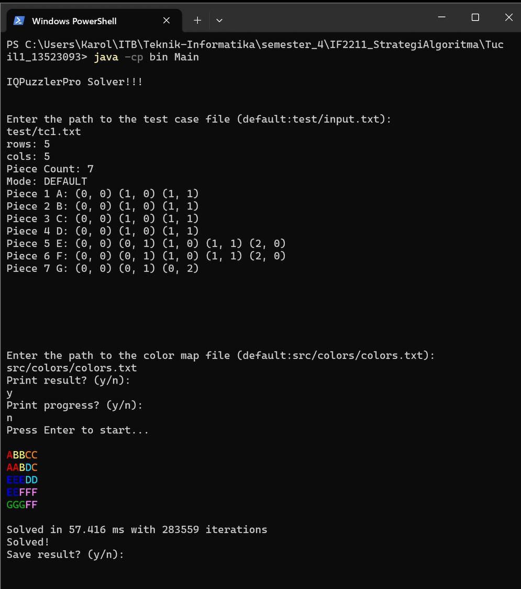

# Tugas Kecil 1 Strategi Algoritma

## Deskripsi Program
Program ini merupakan adaptasi dari permainan **IQ Puzzle Pro** yang merupakan permainan susun puzzle berbasis grid. Program ini dikembangkan menggunakan bahasa **Java** dan mengimplementasikan algoritma **Brute Force** untuk mencari sebuah solusi penyusunan puzzle.

## Teknologi yang Digunakan
- **Bahasa Pemrograman** : Java
- **Dependencies** : Java Development Kit (JDK)
- **Algoritma** : Brute Force

## Clone Repository
```bash
git clone https://github.com/karolyangqian/Tucil1_13523093.git
```

## Cara Mengkompilasi Program
```bash
javac -d bin src/*.java src/iqpuzzlerpro/*.java
```

## Cara Menjalankan Program
```bash
java -cp bin Main
```

## Simulasi Cara Menjalankan Program
Silakan tekan gambar untuk menonton video simulasi menjalankan program.
[](simulasi.mp4)

## Informasi Pembuat
**Nama**  : Karol Yangqian Poetracahya  
**NIM**   : 13523093  
**Jurusan** : Teknik Informatika